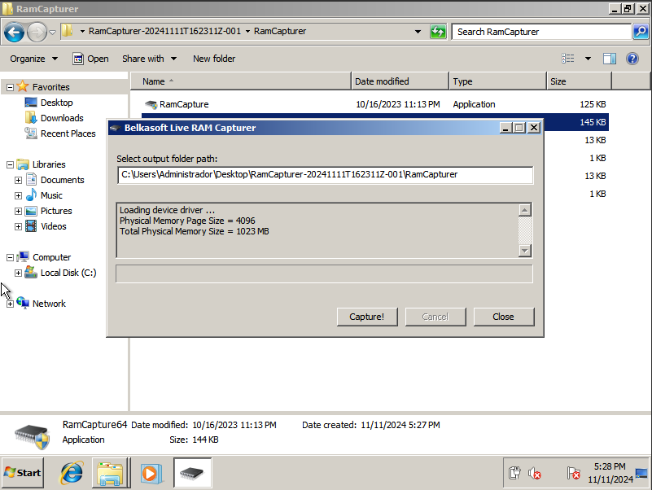
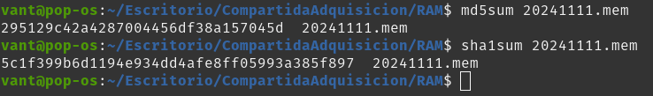
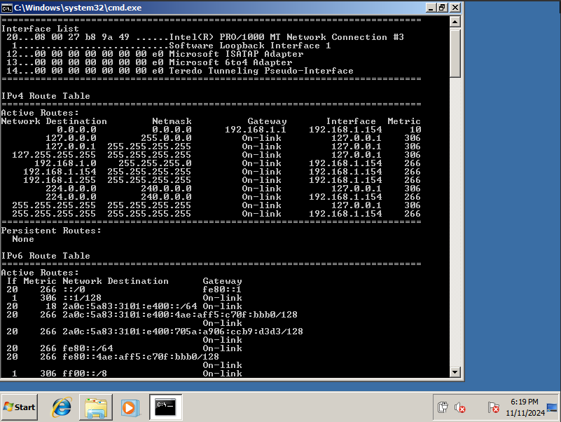
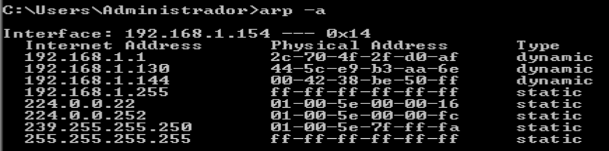
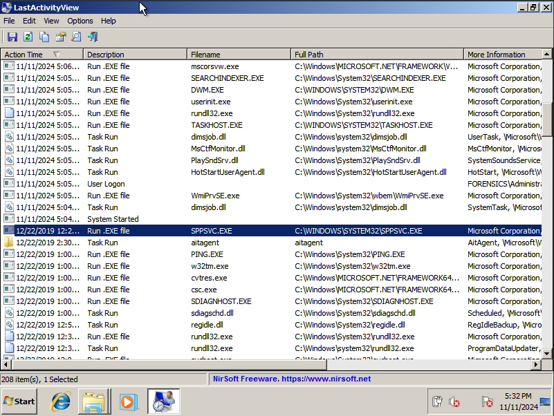
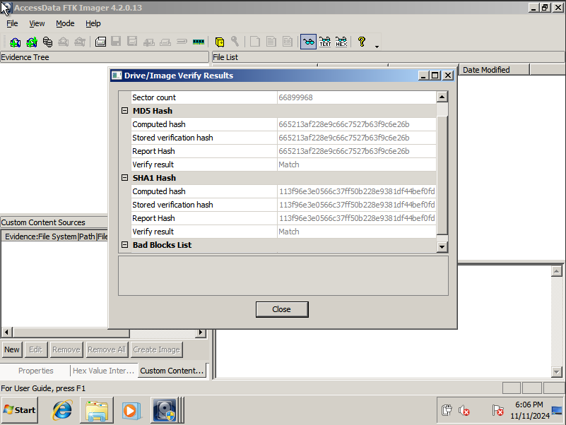
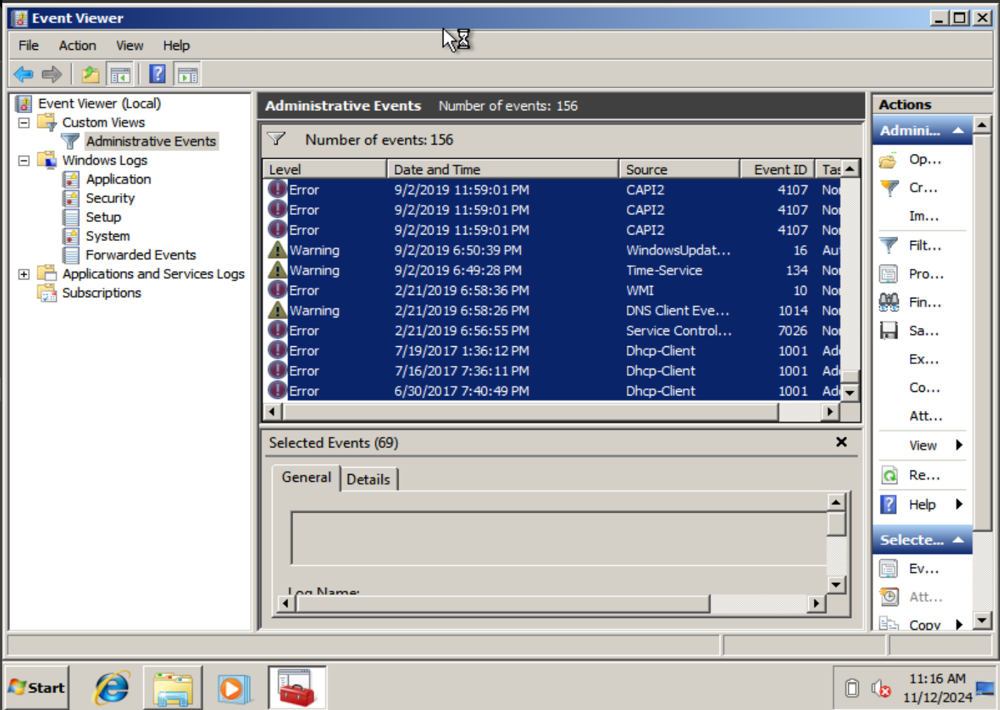

# Incident investigation

## Recolección y almacenamiento de evidencias

En esta práctica se documentará el proceso de adquisición y análisis forense de una máquina comprometida, siguiendo la metodología de nuestra empresa para asegurar la integridad y autenticidad de las evidencias. La recolección incluirá información clave como la **tabla de enrutamiento**, el **caché ARP**, los **procesos,**  la  **memoria**, el contenido del **disco**, los **logs del sistema** y la **topología de red**.

La investigación se estructura en cinco etapas: **recolección de evidencias**, **descripción de la evidencia**, **cadena de custodia**, **almacenamiento** y **metodología aplicada**. En cada fase, se implementan protocolos rigurosos para que la información refleje con precisión el estado del sistema en el momento de su adquisición.

Este informe detalla cada uno de estos pasos, desde la obtención de datos críticos en la máquina comprometida hasta su conservación en un entorno seguro, asegurando su idoneidad para análisis detallados y posibles fines legales.

## RAM

Para la adquisición de la memoria RAM, se utilizó **RAM Capturer** siguiendo estos pasos:

1. **Captura**: RAM Capturer se utilizó para volcar el contenido completo de la memoria, incluyendo procesos activos y datos en caché.
   
    

2. **Integridad**: Se generó un hash del volcado para futuras verificaciones.
   
    

3. **Cadena de custodia**

    | Fecha y Hora de Recolección | 12/11/2024 11:30 
    | :---- | :---- |
    | **Persona Responsable de la Recolección** | Gonzalo Pulido Sánchez |
    | **Transferencias de Custodia** | 13/11/2024 08:30 Manuel Rivas|
    | **Método de Adquisición** | RAM Capturer |
    | **Verificación de Integridad** | **MD5**: 295129c42a4287004456df38a157045d **SHA1**: 5c1f399b6d1194e934dd4afe8ff05993a385f897 |

Este proceso asegura la captura íntegra y segura de la memoria para su análisis.

## Tabla de enrutamiento

Para obtener la tabla de enrutamiento, se utilizó el comando **`route print`** siguiendo estos pasos:

1. **Ejecución del comando**: Se ejecutó `route print` en el sistema comprometido, generando una salida detallada de la tabla de enrutamiento actual.

    

2. **Registro de resultados**: La salida se guardó en un archivo para preservar el estado de las rutas y conexiones en el momento de la adquisición.

    [https://drive.google.com/file/d/1i8wwoCksXlUu61j3yaqeOhPmsxcp0P0n/view?usp=sharing](https://drive.google.com/file/d/1i8wwoCksXlUu61j3yaqeOhPmsxcp0P0n/view?usp=sharing)

3. **Cadena de custodia**
   
    | Fecha y Hora de Recolección | 12/11/2024 11:45 |
    | :---- | :---- |
    | **Persona Responsable de la Recolección** | Gonzalo Pulido Sánchez |
    | **Transferencias de Custodia** | 13/11/2024 08:45 Manuel Rivas|
    | **Método de Adquisición** | route print |
    | **Verificación de Integridad** | **MD5**:  0c104e7466ba30a2b346f21d928434a3 **SHA1**: 58acfbc88f5a8f46c74ab5f6efdf0e9edf1eecd4 |

Este procedimiento asegura que la configuración de enrutamiento se preserve para su análisis sin alteraciones.

## Caché ARP

Para obtener la caché ARP, se ejecutó el comando **`arp -a`** y se realizó una captura de pantalla con el siguiente procedimiento:

1. **Ejecución del comando**: Se utilizó `arp -a` en la máquina comprometida para mostrar las relaciones IP-MAC almacenadas en la caché ARP.    	  

2. **Captura de pantalla**: Se tomó una captura de pantalla de la salida del comando, preservando el estado exacto de la caché en ese momento.
   
   

3. **Cadena de custodia**
   
    | Fecha y Hora de Recolección | 12/11/2024 12:00 |
    | :---- | :---- |
    | **Persona Responsable de la Recolección** | Gonzalo Pulido Sánchez |
    | **Transferencias de Custodia** | 13/11/2024 09:00 Manuel Rivas|
    | **Método de Adquisición** | arp \-a |

Este método permite conservar la información de la caché ARP de forma visual para su análisis.

## Procesos
  
Para la adquisición de información sobre los procesos, se utilizó **LastActivityView** siguiendo este procedimiento: 

1. **Ejecución de LastActivityView**: La herramienta se ejecutó para capturar información detallada sobre todos los procesos en la máquina comprometida, incluyendo eventos y actividades sospechosas.  

2. **Selección de actividad relevante**: Se identificaron y seleccionaron en pantalla aquellos procesos que parecían estar involucrados en la vulneración del sistema, realizando una captura de pantalla de estos para referencia inmediata.

    

3. **Exportación de datos**: LastActivityView generó un archivo con un registro completo de todos los procesos activos, que se guardó para análisis forense.

    [https://drive.google.com/file/d/1vhRUlMAah\_-UNirsQfxds7sIQ3rjVpT9/view?usp=sharing](https://drive.google.com/file/d/1vhRUlMAah_-UNirsQfxds7sIQ3rjVpT9/view?usp=sharing)

4. **Cadena de custodia**

    | Fecha y Hora de Recolección | 12/11/2024 12:15 |
    | :---- | :---- |
    | **Persona Responsable de la Recolección** | Gonzalo Pulido Sánchez |
    | **Transferencias de Custodia** | 13/11/2024 09:15 Manuel Rivas|
    | **Método de Adquisición** | LastActivityView |
    | **Verificación de Integridad** | **MD5**:  dbf10b90147f57fa7741751b95b36e6b **SHA1**: f96eaf5f8f3eac70e401cd4a98b858d5703a2bc6 |

Este procedimiento asegura que los procesos activos y las actividades sospechosas queden registrados y preservados.

## Disco

Para la adquisición del disco, se empleó **FTK Imager** con el siguiente procedimiento:

1. **Configuración de FTK Imager**: La herramienta se configuró para realizar una copia forense completa del disco, garantizando la integridad de los datos durante la adquisición.
    

2. **Captura de la imagen del disco**: FTK Imager generó varios archivos que contienen la imagen forense del disco comprometido, preservando todos los sectores y datos relevantes.

    [https://drive.google.com/drive/folders/1YziS6VRfwXaIIrraOnKxGJ0qNU7D1n0m?usp=sharing](https://drive.google.com/drive/folders/1YziS6VRfwXaIIrraOnKxGJ0qNU7D1n0m?usp=sharing)

3. **Verificación de integridad**: La herramienta generó un archivo `.txt` que incluye los hashes de los archivos de imagen y otra información relevante para futuras comprobaciones de integridad.

    [https://drive.google.com/file/d/1Krlf-088yHBRM9rk4o1dYg37ecNlBDs-/view?usp=drive\_link](https://drive.google.com/file/d/1Krlf-088yHBRM9rk4o1dYg37ecNlBDs-/view?usp=drive_link)

4. **Cadena de custodia**

    | Fecha y Hora de Recolección | 12/11/2024 12:30 |
    | :---- | :---- |
    | **Persona Responsable de la Recolección** | Gonzalo Pulido Sánchez |
    | **Transferencias de Custodia** | 13/11/2024 09:30 Manuel Rivas|
    | **Método de Adquisición** | FTKImager |
    | **Verificación de Integridad** | **MD5**:  665213af228e9c66c7527b63f9c6e26b **SHA1**: 113f96e3e0566c37ff50b228e9381df44bef0fda |

Este proceso asegura la copia exacta del disco para análisis sin riesgo de alteraciones en los datos originales.

## Logs del sistema

Para la adquisición de los logs del sistema, se utilizó la herramienta integrada de Windows, **Event Viewer**, siguiendo estos pasos:

1. **Acceso a Event Viewer**: Se utilizó Event Viewer para acceder a los registros del sistema, específicamente a las **Custom Views** (vistas personalizadas) que contienen eventos relevantes.

    

2. **Exportación de logs**: Se realizó la exportación de los Custom Views, guardando los eventos seleccionados en archivos de registro para conservar los detalles de actividad.

    [https://drive.google.com/file/d/1qXheZASfz\_WwkWdFSHMLojOh2NBQVtC4/view?usp=sharing](https://drive.google.com/file/d/1qXheZASfz_WwkWdFSHMLojOh2NBQVtC4/view?usp=sharing)

3. **Cadena de custodia**

	

    | Fecha y Hora de Recolección | 12/11/2024 12:45 |
    | :---- | :---- |
    | **Persona Responsable de la Recolección** | Gonzalo Pulido Sánchez |
    | **Transferencias de Custodia** | 13/11/2024 09:45 Manuel Rivas|
    | **Método de Adquisición** | Event Viewer |
    | **Verificación de Integridad** | **MD5**:  7f3ab325046ed146638c690a64fc1b3c **SHA1**: 7dbbf4ca695ddc0bd577debc73bd3cd8c73dfd40 |

Este procedimiento garantiza la preservación de los eventos críticos del sistema para su análisis forense.

## Topología

Para la adquisición de la topología de red, se utilizó el comando **`ipconfig`** con el siguiente procedimiento:

1. **Ejecución del comando**: Se ejecutó `ipconfig` en la máquina comprometida para obtener información detallada sobre las interfaces de red, direcciones IP, subredes y puertas de enlace.  
2. **Guardado de los resultados**: Los datos obtenidos del comando se guardaron en un archivo de texto (.txt) para su conservación y análisis.

    [https://drive.google.com/file/d/1Frg\_Ty\_av2ayonYi1nQBKQym2B6mV9Qt/view?usp=drive\_link](https://drive.google.com/file/d/1Frg_Ty_av2ayonYi1nQBKQym2B6mV9Qt/view?usp=drive_link)

3. **Cadena de custodia**

    | Fecha y Hora de Recolección | 12/11/2024 13:00 |
    | :---- | :---- |
    | **Persona Responsable de la Recolección** | Gonzalo Pulido Sánchez |
    | **Transferencias de Custodia** | 13/11/2024 10:00 Manuel Rivas|
    | **Método de Adquisición** | ipconfig |
    | **Verificación de Integridad** | **MD5**:  1215b0cf10cea0be14c2193a9f7ba5f4  **SHA1**: 574f77b6b2949f0ddd01a89f1d5917ebdbc41d60 |

Este proceso asegura que la configuración de la red quede registrada de forma precisa para su posterior análisis forense.

### [Enlace a carpeta compartida de adquisición](https://drive.google.com/drive/folders/1VPakzalB85shnzKCGan1t_-BQgBjFbSp?usp=sharing)